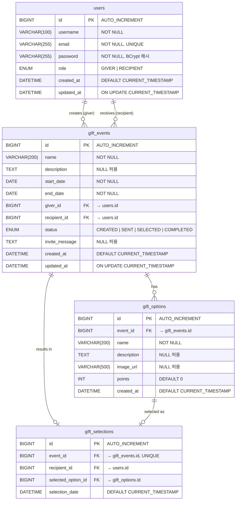

# 🗄️ GiftPick 데이터 모델링

**문서 버전**: v1.0  
**작성일**: 2026-06-29  
**데이터베이스**: MySQL 8.0+ (utf8mb4)

---

## 1. 개요

GiftPick 플랫폼의 핵심 데이터는 4개의 주요 엔티티로 구성됩니다.

| 엔티티 | 테이블명 | 설명 |
|--------|----------|------|
| **User** | `users` | 플랫폼 사용자 (Giver & Recipient) |
| **GiftEvent** | `gift_events` | 선물 이벤트 정보 |
| **GiftOption** | `gift_options` | 이벤트별 선물 후보 옵션 |
| **GiftSelection** | `gift_selections` | Recipient의 최종 선물 선택 기록 |

---

## 2. ERD (Entity-Relationship Diagram)



---

## 3. 테이블 상세 명세

### 3.1 users 테이블

```sql
CREATE TABLE users (
    id          BIGINT          NOT NULL AUTO_INCREMENT,
    username    VARCHAR(100)    NOT NULL                COMMENT '사용자 표시명',
    email       VARCHAR(255)    NOT NULL                COMMENT '로그인 이메일 (고유)',
    password    VARCHAR(255)    NOT NULL                COMMENT 'BCrypt 해시 비밀번호',
    role        ENUM('GIVER', 'RECIPIENT') NOT NULL     COMMENT '사용자 역할',
    created_at  DATETIME        NOT NULL DEFAULT CURRENT_TIMESTAMP,
    updated_at  DATETIME        NOT NULL DEFAULT CURRENT_TIMESTAMP ON UPDATE CURRENT_TIMESTAMP,

    PRIMARY KEY (id),
    UNIQUE KEY uq_users_email (email)
) ENGINE=InnoDB DEFAULT CHARSET=utf8mb4 COLLATE=utf8mb4_unicode_ci
  COMMENT='플랫폼 사용자 계정 테이블';
```

**컬럼 설명:**

| 컬럼 | 타입 | 제약 | 설명 |
|------|------|------|------|
| `id` | BIGINT | PK, AUTO_INCREMENT | 사용자 고유 식별자 |
| `username` | VARCHAR(100) | NOT NULL | 화면에 표시되는 사용자명 |
| `email` | VARCHAR(255) | NOT NULL, UNIQUE | 로그인 이메일 (중복 불가) |
| `password` | VARCHAR(255) | NOT NULL | BCrypt 암호화된 비밀번호 |
| `role` | ENUM | NOT NULL | 사용자 역할 (GIVER / RECIPIENT) |
| `created_at` | DATETIME | NOT NULL | 계정 생성 일시 |
| `updated_at` | DATETIME | NOT NULL | 최종 수정 일시 |

---

### 3.2 gift_events 테이블

```sql
CREATE TABLE gift_events (
    id              BIGINT          NOT NULL AUTO_INCREMENT,
    name            VARCHAR(200)    NOT NULL                COMMENT '이벤트 이름',
    description     TEXT                                    COMMENT '이벤트 설명',
    start_date      DATE            NOT NULL                COMMENT '이벤트 시작일',
    end_date        DATE            NOT NULL                COMMENT '이벤트 종료일',
    giver_id        BIGINT          NOT NULL                COMMENT '이벤트 생성자 (Giver) FK',
    recipient_id    BIGINT          NOT NULL                COMMENT '선물 수혜자 (Recipient) FK',
    status          ENUM('CREATED', 'SENT', 'SELECTED', 'COMPLETED')
                                    NOT NULL DEFAULT 'CREATED' COMMENT '이벤트 진행 상태',
    invite_message  TEXT                                    COMMENT '수혜자에게 전달할 초대 메시지',
    created_at      DATETIME        NOT NULL DEFAULT CURRENT_TIMESTAMP,
    updated_at      DATETIME        NOT NULL DEFAULT CURRENT_TIMESTAMP ON UPDATE CURRENT_TIMESTAMP,

    PRIMARY KEY (id),
    CONSTRAINT fk_gift_events_giver     FOREIGN KEY (giver_id)     REFERENCES users(id) ON DELETE CASCADE,
    CONSTRAINT fk_gift_events_recipient FOREIGN KEY (recipient_id)  REFERENCES users(id) ON DELETE CASCADE,

    INDEX idx_gift_events_giver_id     (giver_id),
    INDEX idx_gift_events_recipient_id (recipient_id),
    INDEX idx_gift_events_status       (status)
) ENGINE=InnoDB DEFAULT CHARSET=utf8mb4 COLLATE=utf8mb4_unicode_ci
  COMMENT='선물 이벤트 테이블';
```

**이벤트 상태 흐름:**

```
CREATED → SENT → SELECTED → COMPLETED
   ↑        ↑        ↑           ↑
 생성됨   초대발송  선물선택됨   구매완료
```

**컬럼 설명:**

| 컬럼 | 타입 | 제약 | 설명 |
|------|------|------|------|
| `id` | BIGINT | PK | 이벤트 고유 식별자 |
| `name` | VARCHAR(200) | NOT NULL | 이벤트 이름 (예: "민수 생일 선물") |
| `description` | TEXT | NULL | 이벤트 상세 설명 |
| `start_date` | DATE | NOT NULL | 이벤트 시작일 |
| `end_date` | DATE | NOT NULL | 이벤트 종료일 (선물 선택 마감) |
| `giver_id` | BIGINT | FK | 이벤트를 생성한 Giver의 users.id |
| `recipient_id` | BIGINT | FK | 선물 수혜자의 users.id |
| `status` | ENUM | NOT NULL | 이벤트 진행 단계 |
| `invite_message` | TEXT | NULL | 초대 시 전달할 메시지 |

---

### 3.3 gift_options 테이블

```sql
CREATE TABLE gift_options (
    id          BIGINT          NOT NULL AUTO_INCREMENT,
    event_id    BIGINT          NOT NULL                COMMENT '소속 이벤트 FK',
    name        VARCHAR(200)    NOT NULL                COMMENT '선물 옵션 이름',
    description TEXT                                    COMMENT '선물 상세 설명',
    image_url   VARCHAR(500)                            COMMENT '선물 이미지 URL',
    points      INT             NOT NULL DEFAULT 0      COMMENT '선물의 포인트 값 (가상 단위)',
    created_at  DATETIME        NOT NULL DEFAULT CURRENT_TIMESTAMP,

    PRIMARY KEY (id),
    CONSTRAINT fk_gift_options_event FOREIGN KEY (event_id) REFERENCES gift_events(id) ON DELETE CASCADE,

    INDEX idx_gift_options_event_id (event_id)
) ENGINE=InnoDB DEFAULT CHARSET=utf8mb4 COLLATE=utf8mb4_unicode_ci
  COMMENT='선물 후보 옵션 테이블';
```

**컬럼 설명:**

| 컬럼 | 타입 | 제약 | 설명 |
|------|------|------|------|
| `id` | BIGINT | PK | 옵션 고유 식별자 |
| `event_id` | BIGINT | FK | 소속 이벤트 (gift_events.id) |
| `name` | VARCHAR(200) | NOT NULL | 선물 상품명 |
| `description` | TEXT | NULL | 선물 상세 설명 |
| `image_url` | VARCHAR(500) | NULL | 선물 이미지 URL |
| `points` | INT | NOT NULL | 선물의 가상 포인트 값 |

---

### 3.4 gift_selections 테이블

```sql
CREATE TABLE gift_selections (
    id                  BIGINT      NOT NULL AUTO_INCREMENT,
    event_id            BIGINT      NOT NULL                COMMENT '이벤트 FK (1이벤트 1선택)',
    recipient_id        BIGINT      NOT NULL                COMMENT '선택한 수혜자 FK',
    selected_option_id  BIGINT      NOT NULL                COMMENT '선택된 선물 옵션 FK',
    selection_date      DATETIME    NOT NULL DEFAULT CURRENT_TIMESTAMP COMMENT '선택 완료 일시',

    PRIMARY KEY (id),
    UNIQUE KEY uq_gift_selections_event (event_id),      -- 이벤트당 1회 선택만 허용
    CONSTRAINT fk_gift_selections_event    FOREIGN KEY (event_id)           REFERENCES gift_events(id)  ON DELETE CASCADE,
    CONSTRAINT fk_gift_selections_recipient FOREIGN KEY (recipient_id)      REFERENCES users(id)        ON DELETE CASCADE,
    CONSTRAINT fk_gift_selections_option   FOREIGN KEY (selected_option_id) REFERENCES gift_options(id) ON DELETE RESTRICT
) ENGINE=InnoDB DEFAULT CHARSET=utf8mb4 COLLATE=utf8mb4_unicode_ci
  COMMENT='수혜자 최종 선물 선택 기록 테이블';
```

**컬럼 설명:**

| 컬럼 | 타입 | 제약 | 설명 |
|------|------|------|------|
| `id` | BIGINT | PK | 선택 기록 고유 식별자 |
| `event_id` | BIGINT | FK, UNIQUE | 이벤트 1개당 선택 1개만 허용 |
| `recipient_id` | BIGINT | FK | 선택한 Recipient의 users.id |
| `selected_option_id` | BIGINT | FK | 선택된 gift_options.id |
| `selection_date` | DATETIME | NOT NULL | 선택 확정 일시 |

---

## 4. 관계 정의 (Relationships)

| 관계 | 카디널리티 | 설명 |
|------|-----------|------|
| users → gift_events (giver) | 1 : N | 한 Giver가 여러 이벤트를 생성 |
| users → gift_events (recipient) | 1 : N | 한 Recipient가 여러 이벤트에 초대 가능 |
| gift_events → gift_options | 1 : N | 하나의 이벤트에 여러 선물 옵션 등록 가능 |
| gift_events → gift_selections | 1 : 0..1 | 이벤트당 최대 하나의 선택 기록 |
| gift_options → gift_selections | 1 : 0..1 | 하나의 옵션이 하나의 선택 기록으로 귀결 |

---

## 5. 인덱스 전략

| 테이블 | 인덱스 컬럼 | 목적 |
|--------|-----------|------|
| `users` | `email` (UNIQUE) | 로그인 시 이메일 조회 |
| `gift_events` | `giver_id` | Giver의 이벤트 목록 조회 |
| `gift_events` | `recipient_id` | Recipient의 초대 이벤트 조회 |
| `gift_events` | `status` | 상태별 필터링 조회 |
| `gift_options` | `event_id` | 이벤트의 옵션 목록 조회 |
| `gift_selections` | `event_id` (UNIQUE) | 이벤트 선택 결과 조회 + 중복 방지 |

---

## 6. JPA Entity 매핑 (참고)

### User Entity
```java
@Entity
@Table(name = "users")
public class User {
    @Id @GeneratedValue(strategy = GenerationType.IDENTITY)
    private Long id;
    
    @Column(nullable = false, length = 100)
    private String username;
    
    @Column(nullable = false, unique = true)
    private String email;
    
    @Column(nullable = false)
    private String password; // BCrypt 암호화
    
    @Enumerated(EnumType.STRING)
    @Column(nullable = false)
    private Role role; // GIVER, RECIPIENT
    
    @CreationTimestamp
    private LocalDateTime createdAt;
    
    @UpdateTimestamp
    private LocalDateTime updatedAt;
}
```

### GiftEvent Entity
```java
@Entity
@Table(name = "gift_events")
public class GiftEvent {
    @Id @GeneratedValue(strategy = GenerationType.IDENTITY)
    private Long id;
    
    @Column(nullable = false, length = 200)
    private String name;
    
    @Column(columnDefinition = "TEXT")
    private String description;
    
    @Column(nullable = false)
    private LocalDate startDate;
    
    @Column(nullable = false)
    private LocalDate endDate;
    
    @ManyToOne(fetch = FetchType.LAZY)
    @JoinColumn(name = "giver_id", nullable = false)
    private User giver;
    
    @ManyToOne(fetch = FetchType.LAZY)
    @JoinColumn(name = "recipient_id", nullable = false)
    private User recipient;
    
    @Enumerated(EnumType.STRING)
    @Column(nullable = false)
    private EventStatus status; // CREATED, SENT, SELECTED, COMPLETED
    
    @Column(columnDefinition = "TEXT")
    private String inviteMessage;
    
    @OneToMany(mappedBy = "event", cascade = CascadeType.ALL, orphanRemoval = true)
    @Fetch(FetchMode.SUBSELECT) // N+1 방지
    private List<GiftOption> options = new ArrayList<>();
    
    @OneToOne(mappedBy = "event", cascade = CascadeType.ALL)
    private GiftSelection selection;
}
```

---

## 7. 데이터베이스 초기화 SQL

```sql
-- 데이터베이스 생성
CREATE DATABASE IF NOT EXISTS giftpick_db
  CHARACTER SET utf8mb4
  COLLATE utf8mb4_unicode_ci;

USE giftpick_db;

-- 테이블 생성 (순서 중요: FK 참조 순서 고려)
-- 1. users → 2. gift_events → 3. gift_options → 4. gift_selections
```

---

## 8. 샘플 데이터 (DataInitializer)

```sql
-- 데모 계정 (DataInitializer.java에서 자동 삽입)
INSERT INTO users (username, email, password, role) VALUES
('김기버', 'giver@example.com', '$2a$10$...BCrypt Hash...', 'GIVER'),
('이민수', 'minsu@example.com', '$2a$10$...BCrypt Hash...', 'RECIPIENT');
```
