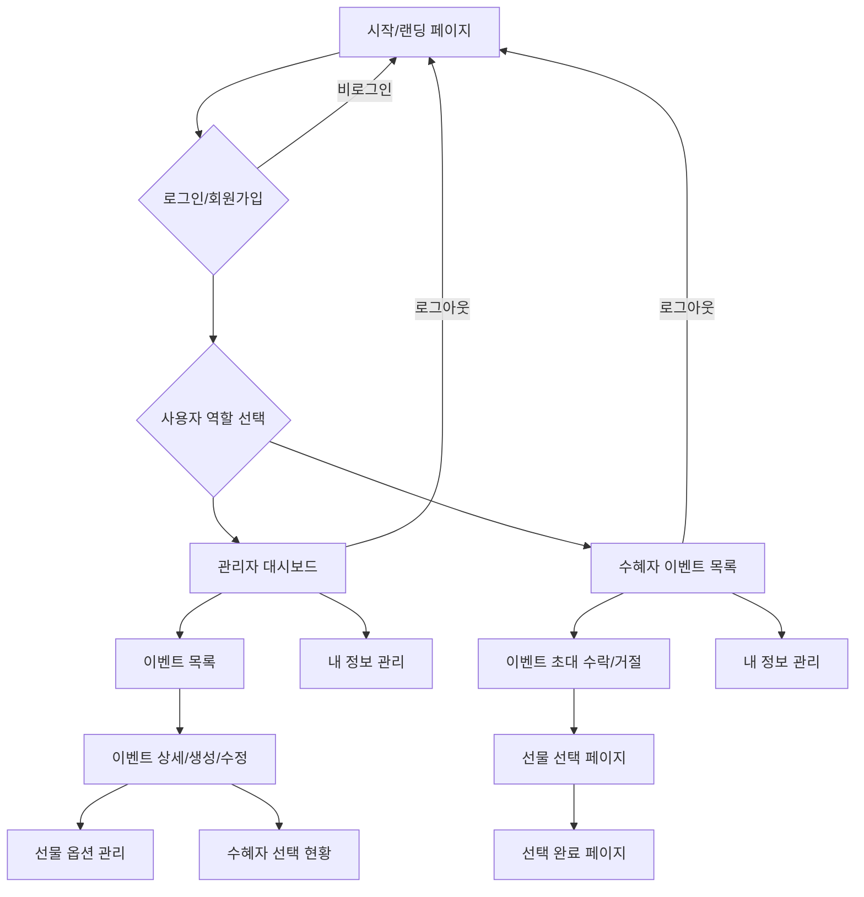

# 생일 선물 선택 플랫폼 화면 설계서

## 1. 개요

본 문서는 '소중한 사람의 생일 선물 선택 플랫폼'의 상세 화면 설계를 다룹니다. 백엔드 Java, 프론트엔드 React 기반의 시스템 아키텍처를 바탕으로, 사용자(선물 관리자 및 선물 수혜자)의 원활한 서비스 이용을 위한 화면 흐름, 레이아웃, 주요 UI 컴포넌트 및 인터랙션을 정의합니다.

## 2. 서비스 맵 (Sitemap)

플랫폼의 전체적인 화면 구조 및 흐름은 다음과 같습니다.

## 3. 공통 UI 컴포넌트

플랫폼 전반에 걸쳐 사용될 공통 UI 컴포넌트 및 디자인 가이드라인을 정의합니다.

### 3.1. 헤더 (Header)

*   **구성**: 로고, 서비스명, 네비게이션 메뉴 (로그인/회원가입, 대시보드, 내 이벤트, 내 정보 등), 사용자 프로필/로그아웃 버튼
*   **반응형**: 모바일 환경에서는 햄버거 메뉴 등으로 전환

### 3.2. 푸터 (Footer)

*   **구성**: 회사 정보, 저작권, 개인정보처리방침, 이용약관 등

### 3.3. 네비게이션 (Navigation)

*   **관리자**: 대시보드, 이벤트 관리, 내 정보
*   **수혜자**: 내 이벤트, 내 정보
*   **비로그인**: 로그인, 회원가입

### 3.4. 버튼 (Buttons)

*   **Primary Button**: 주요 액션 (예: '이벤트 생성', '선물 선택', '로그인')
*   **Secondary Button**: 보조 액션 (예: '취소', '뒤로가기')
*   **Danger Button**: 위험 액션 (예: '삭제')

### 3.5. 입력 필드 (Input Fields)

*   텍스트 입력, 숫자 입력, 날짜 선택 등 다양한 타입 지원
*   유효성 검사 및 에러 메시지 표시

### 3.6. 모달/팝업 (Modal/Popup)

*   사용자에게 중요한 정보 전달 또는 추가적인 입력이 필요할 때 사용
*   예: 선물 선택 확인, 이벤트 삭제 확인

### 3.7. 알림 (Notifications)

*   작업 성공/실패, 새로운 이벤트 알림 등 사용자에게 피드백 제공
*   토스트 메시지 또는 스낵바 형태로 구현

### 3.8. 카드 (Card) 컴포넌트

*   이벤트 목록, 선물 옵션 목록 등 개별 항목을 시각적으로 구분하여 표시할 때 사용
*   제목, 설명, 이미지, 액션 버튼 등으로 구성

## 4. 다음 단계

다음 단계에서는 위에서 정의된 공통 컴포넌트와 서비스 맵을 바탕으로 관리자(Giver)용 주요 화면을 상세히 설계할 예정입니다.

## 5. 관리자(Giver)용 주요 화면 설계

### 5.1. 로그인/회원가입 페이지

*   **URL**: `/login`, `/register`
*   **레이아웃**: 중앙 정렬된 폼, 로고, 서비스명
*   **구성 요소**:
    *   **로그인**: 이메일/비밀번호 입력 필드, 로그인 버튼, 회원가입 링크, 비밀번호 찾기 링크
    *   **회원가입**: 사용자명, 이메일, 비밀번호, 비밀번호 확인 입력 필드, 역할 선택 (관리자/수혜자), 회원가입 버튼, 로그인 링크
*   **인터랙션**: 유효성 검사, 로그인/회원가입 성공 시 대시보드로 리다이렉트

### 5.2. 관리자 대시보드

*   **URL**: `/admin/dashboard`
*   **레이아웃**: 헤더, 사이드 네비게이션 (이벤트 관리, 내 정보), 메인 콘텐츠 영역
*   **구성 요소**:
    *   **환영 메시지**: 로그인한 관리자 이름 표시
    *   **요약 정보**: 진행 중인 이벤트 수, 완료된 이벤트 수, 대기 중인 선택 수 등 주요 지표 요약
    *   **최근 이벤트 목록**: 최근 생성되거나 업데이트된 이벤트 목록 (이벤트명, 수혜자, 상태, 생성일)
    *   **바로가기 버튼**: '새 이벤트 생성', '이벤트 목록 보기' 등
*   **인터랙션**: 각 이벤트 클릭 시 이벤트 상세 페이지로 이동, 버튼 클릭 시 해당 기능 페이지로 이동

### 5.3. 이벤트 목록 페이지

*   **URL**: `/admin/events`
*   **레이아웃**: 헤더, 사이드 네비게이션, 이벤트 목록 테이블/카드 뷰, 검색/필터링 영역, 페이지네이션
*   **구성 요소**:
    *   **검색/필터링**: 이벤트명, 수혜자 이름 등으로 검색, 상태(진행 중, 완료 등) 필터링
    *   **이벤트 목록**: 각 이벤트는 카드 또는 테이블 형태로 표시
        *   **카드**: 이벤트명, 수혜자, 상태, 생성일, '상세 보기', '수정', '삭제' 버튼
        *   **테이블**: 이벤트명, 수혜자, 시작일, 종료일, 상태, 액션 (상세 보기, 수정, 삭제)
    *   **'새 이벤트 생성' 버튼**
*   **인터랙션**: 검색/필터링 기능, 이벤트 클릭 시 상세 페이지 이동, 수정/삭제 버튼 클릭 시 모달/페이지 이동

### 5.4. 이벤트 생성/수정 페이지

*   **URL**: `/admin/events/new`, `/admin/events/{eventId}/edit`
*   **레이아웃**: 헤더, 사이드 네비게이션, 폼 영역
*   **구성 요소**:
    *   **폼 필드**:
        *   이벤트명 (텍스트 입력)
        *   이벤트 설명 (텍스트 영역)
        *   수혜자 선택 (기존 사용자 검색/선택 또는 새 수혜자 정보 입력)
        *   이벤트 시작일/종료일 (날짜 선택)
        *   초대 메시지 (텍스트 영역, 선택 사항)
    *   **'저장' / '수정' 버튼**, **'취소' 버튼**
*   **인터랙션**: 유효성 검사, 저장/수정 성공 시 이벤트 상세 또는 목록 페이지로 리다이렉트

### 5.5. 이벤트 상세 페이지

*   **URL**: `/admin/events/{eventId}`
*   **레이아웃**: 헤더, 사이드 네비게이션, 이벤트 정보 요약, 선물 옵션 목록, 수혜자 선택 현황
*   **구성 요소**:
    *   **이벤트 정보**: 이벤트명, 설명, 수혜자 정보, 기간, 상태
    *   **초대 링크**: 수혜자에게 전달할 초대 링크 표시 및 복사 버튼
    *   **선물 옵션 관리 섹션**:
        *   현재 등록된 선물 옵션 목록 (옵션명, 설명, 이미지, 포인트, '수정', '삭제' 버튼)
        *   **'선물 옵션 추가' 버튼**
    *   **수혜자 선택 현황 섹션**:
        *   수혜자의 선택 여부, 선택된 선물 옵션 정보 (옵션명, 이미지, 선택일시)
        *   선택 완료 시 '구매 진행' 버튼 (관리자가 실제 구매를 진행했음을 표시)
    *   **'이벤트 수정' 버튼**, **'이벤트 삭제' 버튼**
*   **인터랙션**: 선물 옵션 추가/수정/삭제, 선택 현황 확인, 이벤트 수정/삭제

### 5.6. 선물 옵션 관리 모달/페이지

*   **URL**: (모달로 구현 시 별도 URL 없음), `/admin/events/{eventId}/options/new`, `/admin/events/{eventId}/options/{optionId}/edit`
*   **레이아웃**: 폼 영역 (모달 또는 별도 페이지)
*   **구성 요소**:
    *   **폼 필드**:
        *   옵션명 (텍스트 입력)
        *   옵션 설명 (텍스트 영역)
        *   이미지 업로드 (파일 업로드 컴포넌트)
        *   필요 포인트 (숫자 입력)
    *   **'저장' / '수정' 버튼**, **'취소' 버튼**
*   **인터랙션**: 유효성 검사, 저장/수정 성공 시 이벤트 상세 페이지로 돌아가기

## 6. 다음 단계

다음 단계에서는 수혜자(Recipient)용 주요 화면을 상세히 설계할 예정입니다.

## 7. 수혜자(Recipient)용 주요 화면 설계

### 7.1. 초대 수락/거절 페이지

*   **URL**: `/invite/{eventId}`
*   **레이아웃**: 이벤트 정보 요약, 수락/거절 버튼
*   **구성 요소**:
    *   **이벤트 정보**: 이벤트명, 관리자(Giver) 이름, 간단한 초대 메시지
    *   **버튼**: '초대 수락', '초대 거절'
*   **인터랙션**: 초대 수락 시 선물 선택 페이지로 이동, 거절 시 거절 메시지 표시 후 랜딩 페이지로 이동

### 7.2. 선물 선택 페이지

*   **URL**: `/events/{eventId}/select`
*   **레이아웃**: 헤더, 이벤트 정보, 선물 옵션 목록, 선택 버튼
*   **구성 요소**:
    *   **이벤트 정보**: 이벤트명, 관리자(Giver) 이름, 남은 선택 기간
    *   **선물 옵션 목록**: 각 선물 옵션은 카드 형태로 표시
        *   **카드**: 선물명, 설명, 이미지, 필요 포인트 (또는 선택 단위)
        *   선택된 옵션은 시각적으로 강조 (예: 테두리 색상 변경, 체크 표시)
    *   **'선택 완료' 버튼**: 하나의 옵션을 선택했을 때 활성화
*   **인터랙션**: 선물 옵션 클릭 시 선택/선택 해제, '선택 완료' 버튼 클릭 시 선택 확인 모달 팝업, 확인 시 선택 완료 페이지로 이동

### 7.3. 선택 완료 페이지

*   **URL**: `/events/{eventId}/selected`
*   **레이아웃**: 헤더, 완료 메시지, 선택된 선물 정보
*   **구성 요소**:
    *   **완료 메시지**: 

        *   "선물 선택이 완료되었습니다!" 또는 "관리자에게 선택 내용이 전달되었습니다."
    *   **선택된 선물 정보**: 선택한 선물 옵션의 이름, 이미지, 설명
    *   **안내 메시지**: "관리자가 선물을 확인하고 구매를 진행할 예정입니다. 잠시만 기다려 주세요."
*   **인터랙션**: 홈으로 돌아가기 버튼, 다른 이벤트 목록 보기 버튼

### 7.4. 내 정보 관리 페이지

*   **URL**: `/profile`
*   **레이아웃**: 헤더, 사용자 정보 표시 및 수정 폼
*   **구성 요소**:
    *   **사용자 정보**: 이름, 이메일, 역할 표시
    *   **정보 수정 폼**: 이름, 비밀번호 변경 필드
    *   **탈퇴 버튼**
*   **인터랙션**: 정보 수정 후 저장, 비밀번호 변경, 회원 탈퇴

## 8. 다음 단계

다음 단계에서는 작성된 모든 화면 설계 내용을 통합하고 최종 문서를 사용자에게 전달할 예정입니다.
