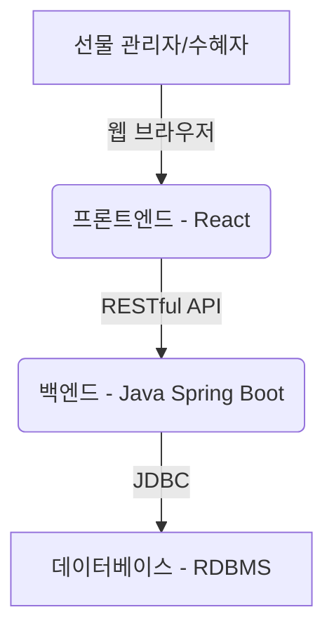
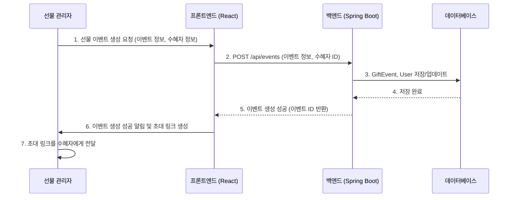
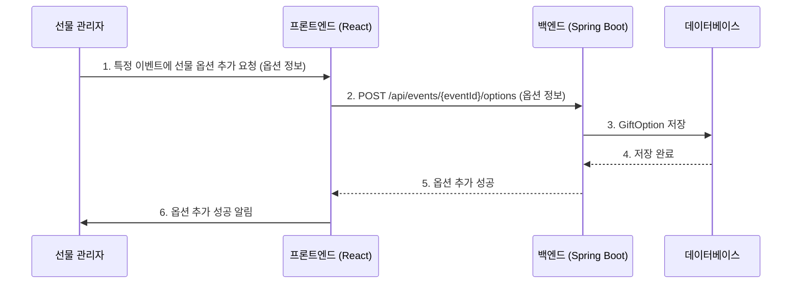
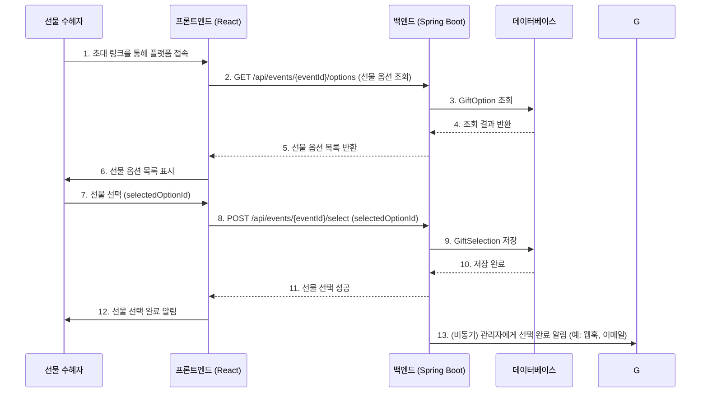
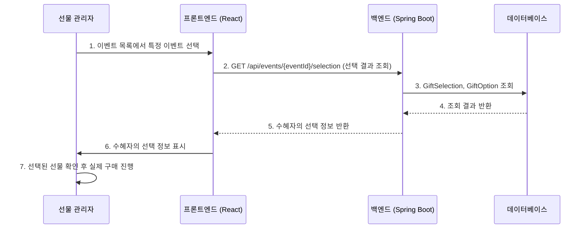

# 생일 선물 선택 플랫폼 기본 설계

## 1. 개요

본 문서는 소중한 사람의 생일 선물을 직접 고를 수 있도록 포인트를 제공하고, 선택된 선물을 관리자(선물 주는 사람)에게 전달하여 실제 구매가 이루어지도록 하는 플랫폼의 기본 설계를 다룹니다. 백엔드는 Java, 프론트엔드는 React 기술 스택을 기반으로 합니다.

## 2. 주요 기능 및 사용자 시나리오

### 2.1. 사용자 역할

*   **선물 관리자 (Gift Administrator / Giver)**: 선물을 주는 사람으로, 선물 이벤트를 생성하고, 선물 옵션을 등록하며, 수혜자의 선택을 확인하고 실제 구매를 진행합니다.
*   **선물 수혜자 (Gift Recipient)**: 선물을 받는 사람으로, 관리자가 제공한 선물 옵션 중에서 하나를 선택합니다.

### 2.2. 주요 기능

1.  **선물 이벤트 생성 및 관리**: 관리자가 특정 수혜자를 대상으로 선물 이벤트를 생성하고 관리합니다.
2.  **선물 옵션 등록**: 관리자가 수혜자가 선택할 수 있는 선물 품목(옵션)을 등록합니다. 각 품목은 이름, 설명, 이미지, 가상의 포인트(또는 선택 단위) 등을 가질 수 있습니다.
3.  **포인트 제공 (선택 권한 부여)**: 관리자가 수혜자에게 선물 선택을 위한 '포인트'를 부여합니다. 이 포인트는 실제 화폐가 아닌, 선택 권한을 의미하는 가상의 단위로 사용됩니다.
4.  **선물 선택**: 수혜자가 제공된 선물 옵션 목록을 확인하고, 부여받은 포인트 내에서 하나의 선물을 선택합니다.
5.  **선택 내용 전달 및 확인**: 수혜자의 선택 내용은 실시간으로 관리자에게 전달됩니다.
6.  **선물 구매 진행**: 관리자는 수혜자가 선택한 선물을 확인하고, 해당 선물을 직접 구매하여 수혜자에게 전달합니다.

### 2.3. 사용자 시나리오

1.  **선물 관리자**: 
    *   로그인 후 '새 선물 이벤트 생성' 버튼 클릭
    *   이벤트 이름, 수혜자 정보(이메일 등), 이벤트 기간 입력
    *   선물 옵션 목록 추가 (예: 'A 상품 (100 포인트)', 'B 상품 (100 포인트)', 'C 상품 (100 포인트)')
    *   수혜자에게 이벤트 초대 링크 발송
    *   수혜자의 선택 완료 알림 수신
    *   선택된 선물 정보 확인 후 실제 구매 진행

2.  **선물 수혜자**: 
    *   관리자로부터 받은 초대 링크를 통해 플랫폼 접속
    *   제공된 선물 옵션 목록 확인
    *   마음에 드는 선물 하나를 선택
    *   선택 완료

## 3. 시스템 아키텍처 (고수준)

본 플랫폼은 클라이언트-서버 아키텍처를 기반으로 하며, 백엔드와 프론트엔드가 분리된 형태로 구성됩니다.

*   **프론트엔드 (React)**: 사용자 인터페이스(UI)를 담당하며, 선물 관리자 및 수혜자가 플랫폼과 상호작용하는 웹 애플리케이션입니다. RESTful API를 통해 백엔드와 통신합니다.
*   **백엔드 (Java - Spring Boot)**: 비즈니스 로직 처리, 데이터베이스 연동, API 제공, 사용자 인증 및 권한 관리 등을 담당합니다. Spring Boot 프레임워크를 활용하여 개발됩니다.
*   **데이터베이스 (RDBMS)**: 모든 플랫폼 데이터를 저장하고 관리합니다. (예: MySQL, PostgreSQL)



## 4. 데이터 모델 (고수준)

주요 엔티티는 다음과 같습니다.

*   **User**: 사용자 정보 (관리자, 수혜자)
*   **GiftEvent**: 선물 이벤트 정보 (이벤트명, 기간, 관리자, 수혜자)
*   **GiftOption**: 각 선물 이벤트에 속하는 선물 옵션 정보 (상품명, 설명, 이미지 URL, 포인트)
*   **GiftSelection**: 수혜자의 선물 선택 정보 (선택된 GiftOption, 선택 일시)

## 5. 기술 스택

*   **백엔드**: Java 17+, Spring Boot 3+, Spring Data JPA, Maven/Gradle
*   **프론트엔드**: React 18+, TypeScript, React Router, Axios, Tailwind CSS (선택 사항)
*   **데이터베이스**: MySQL 8.0+ 또는 PostgreSQL
*   **배포**: Docker, AWS EC2/ECS 또는 Google Cloud Run (선택 사항)

## 6. 다음 단계

다음 단계에서는 위에서 정의된 요구사항과 고수준 아키텍처를 바탕으로 상세 시스템 아키텍처 다이어그램과 ERD(Entity-Relationship Diagram)를 작성할 예정입니다.

## 7. 상세 시스템 아키텍처

### 7.1. 프론트엔드 (React)

React 애플리케이션은 사용자 경험(UX)을 최우선으로 고려하여 설계됩니다. 주요 구성 요소는 다음과 같습니다.

*   **컴포넌트 기반 개발**: 재사용 가능한 UI 컴포넌트(예: 선물 카드, 이벤트 목록, 선택 버튼)를 활용하여 개발 효율성을 높입니다.
*   **상태 관리**: React Context API 또는 Redux, Zustand와 같은 라이브러리를 사용하여 전역 상태를 효율적으로 관리합니다.
*   **라우팅**: React Router를 사용하여 페이지 간 이동 및 URL 관리를 처리합니다.
*   **API 연동**: Axios와 같은 HTTP 클라이언트를 사용하여 백엔드 RESTful API와 통신합니다.
*   **인증/인가**: JWT(JSON Web Token) 기반 인증 방식을 사용하여 사용자 로그인 상태를 유지하고, 역할(관리자/수혜자)에 따른 접근 권한을 제어합니다.

### 7.2. 백엔드 (Java - Spring Boot)

Spring Boot 애플리케이션은 견고하고 확장 가능한 아키텍처를 목표로 합니다. 주요 계층은 다음과 같습니다.

*   **Controller Layer**: 클라이언트의 HTTP 요청을 받아 처리하고, Service Layer로 요청을 전달하며, 응답을 반환합니다. RESTful API 엔드포인트를 정의합니다.
*   **Service Layer**: 비즈니스 로직을 구현하는 핵심 계층입니다. Controller와 Repository 사이의 중재자 역할을 하며, 트랜잭션 관리 및 도메인 로직을 처리합니다.
*   **Repository Layer**: 데이터베이스와의 상호작용을 담당합니다. Spring Data JPA를 활용하여 CRUD(Create, Read, Update, Delete) 작업을 추상화하고, 객체-관계 매핑(ORM)을 통해 데이터베이스 테이블과 Java 객체를 매핑합니다.
*   **Security Layer**: Spring Security를 사용하여 사용자 인증(예: OAuth2, JWT) 및 권한 부여를 처리합니다.
*   **Database**: MySQL 또는 PostgreSQL과 같은 관계형 데이터베이스를 사용하여 데이터를 영속적으로 저장합니다.

```mermaid
graph LR
    subgraph Frontend (React)
        A[사용자 인터페이스] --> B(컴포넌트)
        B --> C(상태 관리)
        C --> D(라우팅)
        D --> E(API 연동 - Axios)
    end

    subgraph Backend (Spring Boot)
        F[Controller Layer] --> G(Service Layer)
        G --> H(Repository Layer)
        H --> I[데이터베이스 - RDBMS]
        F -- 인증/인가 --> J(Security Layer)
    end

    E --> F
```

## 8. ERD (Entity-Relationship Diagram)

플랫폼의 주요 엔티티와 그 관계를 나타내는 ERD는 다음과 같습니다.

```mermaid
erDiagram
    User ||--o{ GiftEvent : 
giver_id "1" : "N" GiftEvent
    User ||--o{ GiftEvent : recipient_id "1" : "N" GiftEvent
    GiftEvent ||--o{ GiftOption : "1" : "N"
    GiftEvent ||--o{ GiftSelection : "1" : "N"
    GiftOption ||--o{ GiftSelection : "1" : "N"

    User {
        VARCHAR id PK
        VARCHAR username
        VARCHAR email
        VARCHAR password
        VARCHAR role "GIVER, RECIPIENT"
    }

    GiftEvent {
        VARCHAR id PK
        VARCHAR name
        TEXT description
        DATE start_date
        DATE end_date
        VARCHAR giver_id FK
        VARCHAR recipient_id FK
        VARCHAR status "CREATED, SENT, SELECTED, COMPLETED"
    }

    GiftOption {
        VARCHAR id PK
        VARCHAR event_id FK
        VARCHAR name
        TEXT description
        VARCHAR image_url
        INT points
    }

    GiftSelection {
        VARCHAR id PK
        VARCHAR event_id FK
        VARCHAR recipient_id FK
        VARCHAR selected_option_id FK
        DATETIME selection_date
    }
```

## 9. 주요 API 설계

백엔드는 RESTful API를 통해 프론트엔드와 통신합니다. 주요 API 엔드포인트는 다음과 같습니다.

### 9.1. 사용자 관련 API

| HTTP Method | Endpoint           | Description              | Request Body                                | Response Body                               |
|-------------|--------------------|--------------------------|---------------------------------------------|---------------------------------------------|
| `POST`      | `/api/auth/register` | 사용자 회원가입          | `{ username, email, password, role }`       | `{ message: "User registered successfully" }` |
| `POST`      | `/api/auth/login`    | 사용자 로그인            | `{ email, password }`                       | `{ token: "jwt_token", user: { id, email, role } }` |
| `GET`       | `/api/users/{id}`  | 특정 사용자 정보 조회    | (없음)                                      | `{ id, username, email, role }`             |

### 9.2. 선물 이벤트 관련 API (관리자 전용)

| HTTP Method | Endpoint                 | Description              | Request Body                                        | Response Body                               |
|-------------|--------------------------|--------------------------|-----------------------------------------------------|---------------------------------------------|
| `POST`      | `/api/events`            | 선물 이벤트 생성         | `{ name, description, startDate, endDate, recipientId }` | `{ id, name, description, ... }`            |
| `GET`       | `/api/events`            | 모든 선물 이벤트 조회    | (없음)                                              | `[ { id, name, description, ... } ]`        |
| `GET`       | `/api/events/{id}`       | 특정 선물 이벤트 조회    | (없음)                                              | `{ id, name, description, ... }`            |
| `PUT`       | `/api/events/{id}`       | 선물 이벤트 수정         | `{ name, description, startDate, endDate }`         | `{ id, name, description, ... }`            |
| `DELETE`    | `/api/events/{id}`       | 선물 이벤트 삭제         | (없음)                                              | `{ message: "Event deleted successfully" }` |
| `POST`      | `/api/events/{id}/options` | 선물 옵션 추가           | `{ name, description, imageUrl, points }`           | `{ id, name, description, ... }`            |

### 9.3. 선물 선택 관련 API (수혜자 전용)

| HTTP Method | Endpoint                       | Description              | Request Body                                | Response Body                               |
|-------------|--------------------------------|--------------------------|---------------------------------------------|---------------------------------------------|
| `GET`       | `/api/events/{id}/options`     | 특정 이벤트의 선물 옵션 조회 | (없음)                                      | `[ { id, name, description, ... } ]`        |
| `POST`      | `/api/events/{id}/select`      | 선물 선택                | `{ selectedOptionId }`                      | `{ message: "Gift selected successfully" }` |
| `GET`       | `/api/events/{id}/selection`   | 수혜자의 선택 결과 조회    | (없음)                                      | `{ id, eventId, recipientId, selectedOptionId, ... }` |

## 10. 서비스 흐름

### 10.1. 선물 이벤트 생성 및 수혜자 초대



### 10.2. 선물 옵션 등록



### 10.3. 수혜자의 선물 선택



### 10.4. 관리자의 선택 확인 및 구매 진행


